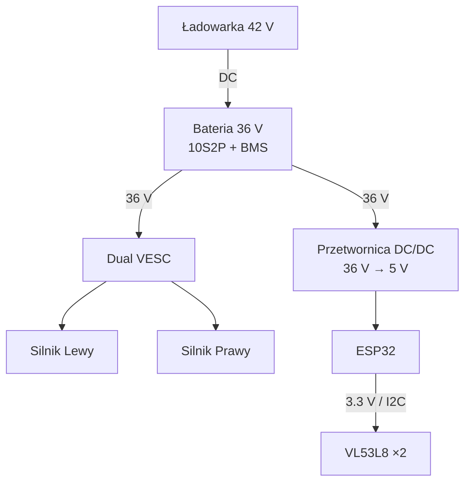

# 🔋⚡ Power Architecture – Robot Follow‑Me

> Dokument spójny stylistycznie z **Dokumentacja techniczna baterii – Robot Follow‑Me**

---

## 📌 1. Cel dokumentu

Celem tego dokumentu jest opis architektury zasilania robota mobilnego typu **Follow‑Me**, zbudowanego w oparciu o podzespoły hoverboardu oraz sterownik **VESC**.

### Założenia projektowe:
- napęd: **2 × silnik BLDC hoverboard**,
- zasilanie główne: **bateria Li‑ion 36 V (10S2P)**,
- sterowanie napędem: **dual VESC**,
- logika sterująca: **ESP32**,
- czujniki odległości: **VL53L8 (I²C)**.

---

## 🧱 2. Główne bloki systemu zasilania

System zasilania robota podzielony jest na trzy logiczne sekcje:

| Sekcja | Funkcja | Napięcie |
|------|--------|--------|
| Zasilanie napędu | VESC + silniki BLDC | 36 V |
| Zasilanie logiki | ESP32, sterowanie | 5 V / 3.3 V |
| Zasilanie czujników | VL53L8, peryferia | 3.3 V |

---

## 🔋 3. Źródło zasilania

Główne źródło energii:
- bateria Li‑ion z hoverboardu,
- konfiguracja: **10S2P**,
- napięcie nominalne: **36 V**,
- napięcie maksymalne: **42 V**,
- energia: **158,4 Wh**,
- **BMS wbudowany**.

### Funkcje baterii:
- zasilanie sterownika VESC,
- zasilanie przetwornicy DC/DC,
- obsługa ładowania przez ładowarkę hoverboard.

---

## 🔌 4. Architektura zasilania (diagram logiczny)

Diagram przedstawia zależności pomiędzy głównymi elementami systemu.

---

## ⚙️ 5. Zasilanie napędu

Sekcja napędowa obejmuje:
- baterię **36 V**,
- sterownik **dual VESC**,
- dwa silniki BLDC hoverboard.

### Zasady projektowe:
- VESC zasilany **bezpośrednio z baterii**,
- między baterią a VESC **bezpiecznik główny**,
- krótkie połączenia dużej mocy,
- przewody o odpowiednim przekroju.

### Zalecenia sprzętowe:

| Element | Zalecenie |
|------|---------|
| Bezpiecznik główny | 15–20 A |
| Przewody BAT → VESC | grube, niskooporowe |
| Złącza mocy | XT60 / XT90 |
| Wyłącznik główny | zalecany |

---

## 🧠 6. Zasilanie logiki sterującej

Elektronika sterująca **nie może** być zasilana bezpośrednio z 36 V.

### Poprawna architektura:
- przetwornica **DC/DC 36 V → 5 V**,
- z 5 V zasilane ESP32,
- napięcie **3.3 V** z ESP32 lub osobnego stabilizatora LDO.

### Powody:
- stabilność pracy ESP32,
- odporność na zakłócenia od silników,
- brak resetów i zawieszeń logiki.

---

## 📡 7. Zasilanie czujników VL53L8

Czujniki wymagają napięcia **3.3 V**.

| Element | Wartość |
|------|------|
| Napięcie zasilania | 3.3 V |
| Interfejs logiczny | I²C (3.3 V) |

### Zalecenia:
- zasilanie z tej samej linii 3.3 V co logika,
- krótka magistrala I²C,
- unikanie prowadzenia równolegle z przewodami silników,
- wspólna masa systemu.

---

## 🔋 8. Ładowanie

Ładowanie realizowane jest przez **oryginalną ładowarkę hoverboard**:
- napięcie ładowania: **42 V**,
- ładowanie przez to samo złącze co zasilanie,
- obsługa i zabezpieczenia przez BMS.

### Zasady bezpieczeństwa:
- ❌ brak jazdy podczas ładowania,
- ❌ nie ładować przez VESC,
- ✅ ładować bezpośrednio przez baterię/BMS,
- ✅ zalecany tryb pracy **RUN / CHARGE**.

---

## ⚠️ 9. Wspólna masa (GND)

Wszystkie elementy muszą posiadać **wspólny punkt odniesienia GND**:
- bateria,
- VESC,
- przetwornica,
- ESP32,
- czujniki.

> ⚠️ Unikać pętli masy — prowadzić masy gwiaździście, z wyraźnym punktem odniesienia.

---

## 🛡️ 10. Zabezpieczenia systemu

| Element | Funkcja |
|------|--------|
| Bezpiecznik główny | ochrona przy zwarciu |
| Wyłącznik zasilania | szybkie odcięcie |
| BMS | ochrona ogniw |
| Limity prądowe VESC | ochrona baterii |
| Filtracja DC/DC | stabilność logiki |

Dodatkowo zalecane:
- kondensator na wejściu przetwornicy,
- separacja wiązek mocy i sygnałów,
- wentylacja sterownika VESC.

---

## 📌 11. Podsumowanie

Architektura zasilania robota powinna być konsekwentnie rozdzielona na:
1. **36 V – sekcja mocy (napęd)**,
2. **5 V – sekcja logiki**,
3. **3.3 V – sekcja czujników**.

Kluczowe zasady:
- napęd bezpośrednio z baterii,
- logika przez przetwornicę,
- czujniki zgodnie z dokumentacją napięciową,
- ładowanie wyłącznie przez BMS,
- brak pracy robota podczas ładowania.

✅ Poprawnie zaprojektowana architektura zasilania jest krytyczna dla:
- stabilności ESP32,
- poprawnych pomiarów czujników,
- bezpieczeństwa baterii,
- niezawodności całego robota.
